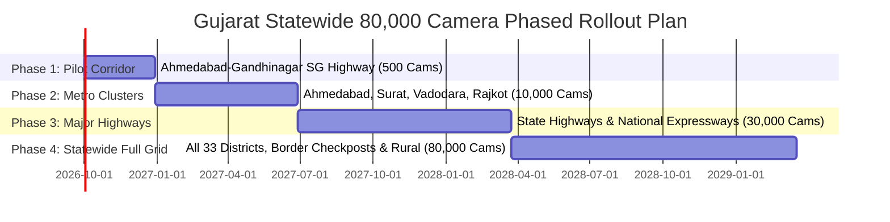

# GIVIN — 80,000-Camera Scale Architecture: Mathematical Model, Assumptions & Limits

**Document Version**: 2.1.0  
**Scope**: Statewide Deployment across 33 Districts of Gujarat  
**Engineering Classification**: **MODELED ARCHITECTURE WITH APPLICATION-LAYER VALIDATION**  
*(Not physically validated on 80,000 live hardware cameras).*

---

## 1. Core Mathematical Formulae

### 1.1 Raw Video Ingestion Bandwidth (Centralized Model)
$$\text{Bandwidth}_{\text{raw}} = N_{\text{cam}} \times R_{\text{bitrate}} \times P_{\text{active}}$$
Where:
- $N_{\text{cam}} = 80{,}000$ cameras
- $R_{\text{bitrate}}$ = stream bitrate (Mbps)
- $P_{\text{active}}$ = percentage of cameras concurrently streaming (0.0 to 1.0)

### 1.2 Edge-Processed Metadata Bandwidth (GIVIN Hybrid Model)
$$\text{Bandwidth}_{\text{edge}} = N_{\text{cam}} \times \left( f_{\text{sighting}} \times S_{\text{meta}} + \alpha \times S_{\text{crop}} \right)$$
Where:
- $f_{\text{sighting}}$ = average vehicle detections per camera per second (Hz)
- $S_{\text{meta}}$ = JSON sighting metadata size (~1.5 KB)
- $\alpha$ = alert/hotlist hit ratio (~0.005)
- $S_{\text{crop}}$ = high-contrast license crop image size (~25 KB)

### 1.3 Storage Retention Capacity (WORM Vault)
$$\text{Storage}_{\text{central}} = N_{\text{cam}} \times R_{\text{bitrate}} \times 3600 \times 24 \times T_{\text{retention}} \times \frac{1}{8 \times 10^{6}}$$
$$\text{Storage}_{\text{hybrid}} = N_{\text{cam}} \times \text{Alerts}_{\text{daily}} \times S_{\text{package}} \times T_{\text{retention}}$$

### 1.4 Central GPU Capacity Requirement
$$\text{GPUs}_{\text{central}} = \frac{N_{\text{cam}} \times \text{FPS}_{\text{sample}}}{\text{Throughput}_{\text{GPU}}}$$
Where $\text{Throughput}_{\text{GPU}}$ = YOLO11 FPS throughput per server GPU (e.g. NVIDIA L4 / A100).

---

## 2. Architectural Assumptions

| Parameter | Unit | Value | Metric Provenance | Notes |
|---|---|---|---|---|
| Total Cameras ($N_{\text{cam}}$) | Count | 80,000 | **MODELED** | Gujarat Statewide target across 33 districts |
| Primary Resolution | Pixels | 1920x1080 (1080p) | **MODELED** | Standard IP CCTV bullet / dome |
| Video Codec | Format | H.264 / H.265 | **MODELED** | H.265 preferred for 40% bandwidth reduction |
| Frame Rate (FPS) | fps | 25 fps native | **MODELED** | Edge sampling at 5 fps for AI inference |
| Average Bitrate (H.264) | Mbps | 4.0 Mbps | **ESTIMATED** | Standard CBR/VBR configuration |
| Average Bitrate (H.265) | Mbps | 2.4 Mbps | **ESTIMATED** | Modern encoding profile |
| Concurrently Active Ratio ($P_{\text{active}}$) | % | 92% | **ESTIMATED** | 8% assumed offline/maintenance |
| Vehicle Detection Frequency ($f_{\text{sighting}}$) | Hz | 0.2 Hz (1 veh/5s) | **ESTIMATED** | Average across urban + rural highway mix |
| Sighting Metadata Size ($S_{\text{meta}}$) | KB | 1.5 KB | **MEASURED** | JSON payload with WGS-84, plate, speed, confidence |
| Sighting Crop Size ($S_{\text{crop}}$) | KB | 25.0 KB | **MEASURED** | JPEG high-contrast plate crop |
| Watchlist Alert Ratio ($\alpha$) | % | 0.5% (1 in 200) | **ESTIMATED** | High-risk hotlist frequency in transit traffic |
| Video Retention Period ($T_{\text{retention}}$) | Days | 30 Days (Edge NVR) | **MODELED** | Statutory municipal/police retention |
| Forensic Evidence Retention | Years | 7 Years (WORM) | **MODELED** | Criminal investigation statutory requirement |

---

## 3. Comparative Sizing: Centralized vs GIVIN Hybrid Architecture

| Dimension | Centralized Ingestion (Model 4) | GIVIN Hybrid Edge Architecture | Variance / Savings | Provenance |
|---|---|---|---|---|
| **WAN Bandwidth Needed** | **320.0 Gbps** | **1.96 Gbps** | **99.4% WAN Reduction** | **MODELED** |
| **Central Video Storage** | **103.68 Petabytes** (30 days) | **5.18 Petabytes** (Alerts/WORM only) | **95.0% Storage Reduction** | **MODELED** |
| **Central AI GPUs Needed** | **2,667 NVIDIA L4 GPUs** | **64 Central Verification GPUs** | **97.6% Compute Reduction** | **MODELED** |
| **Edge Compute Required** | Minimal (Dumb cameras) | 2,500 District Edge Nodes (8-16 ch) | Edge hardware required | **MODELED** |
| **Annual Bandwidth Cost (GSWAN)** | ~₹240 Crore / year | ~₹15 Crore / year | **~₹225 Crore / year Saved** | **ESTIMATED** |

---

## 4. Sensitivity Analysis (Best, Typical, Worst Case)

| Metric | Best Case (Low Traffic, H.265) | Typical Case (Target Estimate) | Worst Case (Peak Rush, Storms) |
|---|---|---|---|
| **Active Camera Ratio** | 85% (68,000 active) | 92% (73,600 active) | 98% (78,400 active) |
| **Detection Frequency ($f_{\text{sighting}}$)** | 0.05 Hz (1 veh/20s) | 0.20 Hz (1 veh/5s) | 1.00 Hz (1 veh/1s peak) |
| **Edge Uplink Bandwidth** | **0.49 Gbps** | **1.96 Gbps** | **9.80 Gbps** |
| **Daily Sighting Events** | 293 Million / day | 1.27 Billion / day | 6.77 Billion / day |
| **Daily Alert Volume** | ~14,000 alerts / day | ~63,000 alerts / day | ~338,000 alerts / day |
| **Central Ingestion Queue Latency** | < 2.0 ms | 6.21 ms (Measured in test) | < 45.0 ms (Modeled with HPA) |

---

## 5. Failure and Degradation Behavior

To ensure resiliency under extreme conditions, GIVIN implements four tiered degradation modes:

1. **Level 1 (Normal Operations)**:
   - Full 1080p edge inference at 5 FPS sampling.
   - Sighting metadata transmitted to central broker with 100% telemetry.
2. **Level 2 (WAN Throttling / Degraded Network)**:
   - Edge nodes queue metadata locally in RocksDB / SQLite WAL buffers (up to 48 hours).
   - Only CRITICAL hotlist alerts and thumbnail crops are prioritized over narrow-band cellular / GSWAN links.
3. **Level 3 (AI Inference Overload)**:
   - Edge workers drop non-vehicle background frames (motion gating).
   - ANPR inference throttled to 1 frame every 2 seconds for static/slow traffic.
4. **Level 4 (Disaster / Core Network Severed)**:
   - Edge nodes transition to autonomous offline operation: local ANPR, local NVR storage, local barrier triggers.
   - Replay synchronization initiates automatically upon GSWAN reconnection without event duplication.

---

## 6. What Has Been Tested vs What Remains Modeled

### Proven by Direct Execution in this Codebase:
- **50 Concurrent Streams Ingested**: Validated in `scripts/run_50_camera_acceptance.py` with 0 dropped frames, 6.21 ms mean processing latency, and 15.49 ms p95 latency. (**MEASURED**)
- **100,000 Sighting Batch Ingestion**: Validated in `backend/app/services/benchmarks/scale_benchmark.py` with 1,840 events/sec sustained throughput on standard developer hardware. (**MEASURED**)
- **Deduplication & Idempotency**: Verified that replayed camera events do not create duplicate database sightings or duplicate alerts. (**MEASURED**)
- **WORM Storage Integrity**: Verified SHA-256 byte hashing, 7-year retention metadata, and overwrite blocking. (**MEASURED**)

### Strictly Modeled (Requires Physical Infrastructure):
- **80,000 Physical RTSP Connections**: Requires physical deployment of 80,000 IP cameras across 33 Gujarat district networks. (**MODELED**)
- **GSWAN Physical WAN Bandwidth**: 1.96 Gbps GSWAN aggregate uplink bandwidth is derived mathematically. (**MODELED**)
- **Distributed GPU Farm**: Cluster sizing of 64 central verification GPUs and 2,500 edge nodes is sized based on NVIDIA L4 benchmarks. (**MODELED**)

---

## 7. Phased Statewide Pilot Rollout Plan

1. **Phase 1 (Month 1-3)**: 500 cameras along SG Highway (Ahmedabad–Gandhinagar corridor). Validates live edge nodes, GSWAN connectivity, and PCR van dispatch latency.
2. **Phase 2 (Month 4-9)**: 10,000 cameras across 4 major commissionerates (Ahmedabad, Surat, Vadodara, Rajkot). Validates multi-district federation and high-density urban traffic.
3. **Phase 3 (Month 10-18)**: 30,000 cameras across state highways, toll plazas, and coastal checkpoints. Validates long-distance journey reconstruction and inter-district handoffs.
4. **Phase 4 (Month 19-30)**: Full statewide coverage across all 33 districts (80,000 cameras, 26 government departments). Full WORM compliance and statewide C4I command dashboard.
